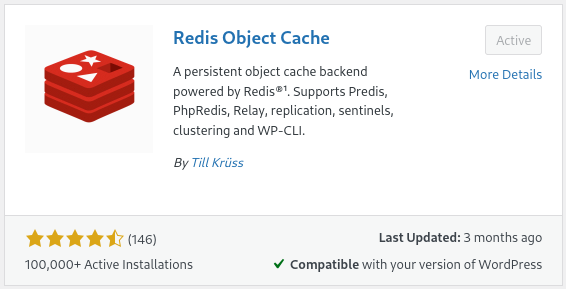

# Docker Wordpress Reverse Proxy Sample

This project contains a collection of docker compose files used to launch a Development Wordpress environment quickly.

Specifically, the services provided include:
- NGINX Reverse Proxy
- Wordpress (Port 80)
- Adminer PHP Web Application (Port 8080)
- Redis Cloudflare Web Application (Port 8001)
- Redis Stack
- MySql Database

## Getting Started

### Docker Network

First, create a new bridged docker network device on the local development machine with the following terminal command:
```bash
$> docker network create default-network
```

### Wordpress Mounted Volumes

Second, create the directories to be mounted by the Wordpress container (this may need to be done by an admin account in order to be readable/writable by the running container instance):
```bash
$> cd ./wordpress &&    \
    mkdir ./plugins &&  \
    mkdir ./themes
```

### Starting the Services

#### Startup Order

Though it may not cause errors it is suggested to start the services in the following order:

1. mysql
2. redis
3. wordpress
4. nginx

#### Shutdown Order

Conversely, when stopping the services it is suggested to follow the reverse order:

1. nginx
2. wordpress
3. redis
4. mysql

### Docker and Compose Commands

#### Start

Starting a service is as simple as going to the applicable subdirectory and issuing the following terminal command from an administrative account, sudoer account, or docker group member account.

```bash
# start the service and detach the terminal from displaying docker machine logs
$> docker compose up -d
```

That's it. Any required images will subsequently be downloaded and any defined volumes will be created.

#### Stop

Stopping a service can be achieved several ways:

1. Stopping the container using docker:
```bash
$> docker container stop $CONTAINER_NAME
# if you wish to delete the container after stopping it:
$> docker container prune
```
2. Stopping the container using docker compose:
```bash
# change into the relevant project sub-directory
$> cd ./mysql &&    \
    docker compose stop
```

#### Removing Volumes

It may be necessary to remove an associated docker storage volume, although this MAY CAUSE DATA LOSS or DELETION.

```bash
# list the available volumes
$> docker volume ls
# delete the volume
$> docker volume rm $VOLUME_NAME
```

### Accessing Applications

To access the running applications, use a web browser on your machine and navigate to:
- localhost:80 (or just localhost) - To access the Wordpress Application
- localhost:8080 - To access the Adminer Application
- localhost:8001 - To access the Redis Stack Application

Alternatively, a separate device attached to the same network may access the services by navigating to the LAN IP address of the host development machine with the corresponding service port:
- 192.168.x.x:{PORT}

### Extras

In order to make use of the Redis instance, Wordpress requires the "Redis Object Cache" plugin By Till Krüss. Once Wordpress has been installed, navigate to the plugins section and search for "redis." This plugin should appear near the top of the search results.



### Additional Notes

None of the Wordpress plugins or themes are included to avoid potential licensing violations/conflicts.

The rest of the project contents are licensed under the BSD 3-Clause license.